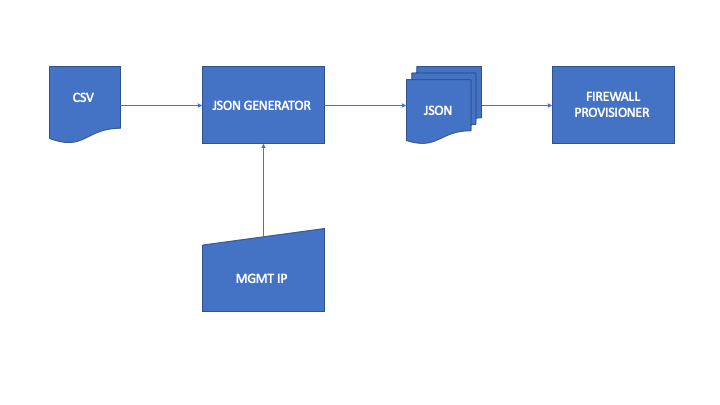

firewall-json-generator
==========

Description
-----------
firewall-json-generator is a file converter that takes csv file containing firewall rules and generate a json file that is needed by the firewall provisioner

System Requirements
-------------------
Tested on MBP 18.5.0 Darwin Kernel Version 18.5.0 but is compatible with most Linux based distribution.

Tested working on Python 3.7.2. No external dependency needed. All libraries used are included by default.

Design Considerations
---------------------


generate.py is a python script requiring two inputs.

1. CSV file: this file contains all the firewall rules in csv format. Path to file is provided via parameter
2. Filename: this string is the filename of the json file generated by this script.

Launching the App:
-------------------
To launch the script: python3 generate.py --source <path_to_csv_source> --filename <output_filename_to_use>

```
firewall-json-generator arvin$ python3 generate.py --source "./Code_Assignment_fw_rule_input.csv" --filename="./192.168.0.1"
2019-06-22 11:55:01,821 root         INFO     Able to read csv file: ./Code_Assignment_fw_rule_input.csv
2019-06-22 11:55:01,822 root         INFO     Able to write to csv file: ./192.168.0.1
```

Script help file for reference:
```
firewall-json-generator arvin$ python3 generate.py --help
usage: generate.py [-h] -s PATH [-f FILENAME] [-l PATH]

Python implementation of firewall json generator

optional arguments:
  -h, --help            show this help message and exit
  -s PATH, --source PATH
                        The source csv file to refer the firewall
                        configurations from.
  -f FILENAME, --filename FILENAME
                        The source csv file to refer the firewall
                        configurations from. Default value is './output.json'.
  -l PATH, --logfile PATH
                        Path to logfile. Default value is './firewall-json-
                        generator.log'.
```

Developer:
----------
Arvin E. Cudanin - DevOps Engineer
email: arvin.cudanin@gmail.com
